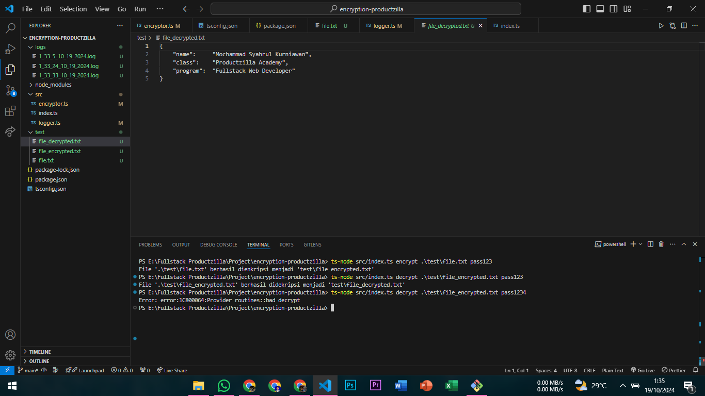

    <h1>ENCRYPTION PROJECT</h1>

    <h2>Description</h2>
    

    Tools for encrypt and decrypt file with <strong>Crypto</strong>
    

    <h2>How to Use</h2>
    <article>
        

            <strong>Encryption</strong>
        

        `ts-node src/index.ts encrypt "your location file" "your password for encryption"`
         
         
        

            
        

         
        

            <strong>Decryption</strong>
        

        `ts-node src/index.ts decrypt "your location file" "your password for encrytption"`
         
         
        

            
        

    </article>
     
     
    <h4 align="center">~ Thank You ~</h4>

